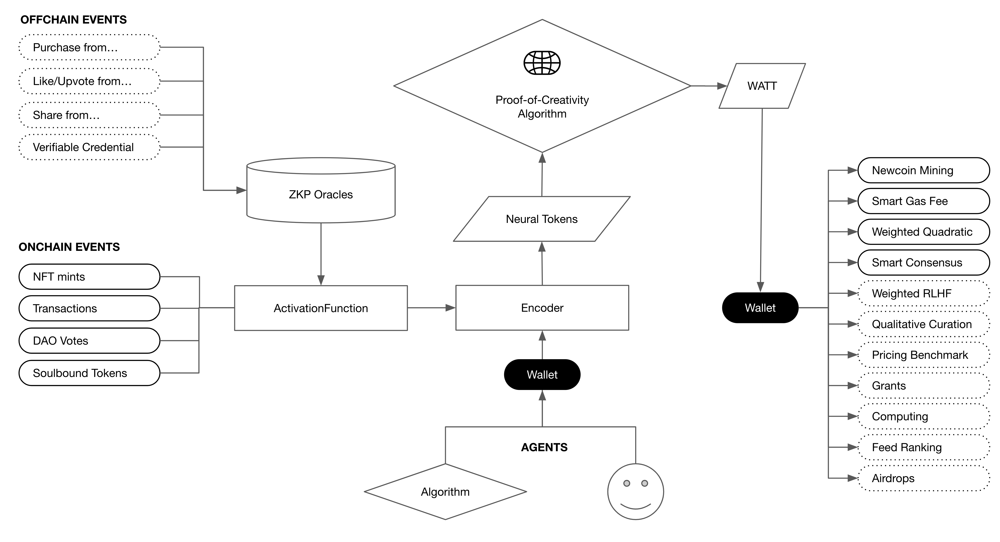

# Proof of Creativity

=======

# Introduction

- [Overview of Newcoin EVM](#overview-of-newcoin-evm)
- [Purpose and Vision](#purpose-and-vision)
- [Features](#features)
- [System Architecture of Newcoin EVM](#system-architecture-of-newcoin-evm)
- [Contributing ActivationFunctions](#contributing-activationfunctions)
- [Running These Contracts](#running-these-contracts)
- [Etherscan verification](#etherscan-verification)
- [Energy ids](#energy-ids)
- [External badges](#external-badges)

## Overview of Newcoin EVM

Newcoin EVM (Ethereum Virtual Machine) is a cutting-edge decentralized algorithm designed to revolutionize the way we discern valuable contributions across digital networks. Built on the principles of robustness, adaptive learning, and recursiveness, Newcoin EVM seeks to provide a seamless interface between diverse systems, ensuring the synergistic interoperability of network intelligence.

## Purpose and Vision

The primary purpose of Newcoin EVM is to harness the power of blockchain technology to create a decentralized, transparent, and efficient system that can interface with a myriad of data sources, both on-chain and off-chain. By leveraging the Proof-of-Creativity algorithm, Newcoin EVM aims to aggregate a vast spectrum of human assessments and algorithmic scores, offering a holistic view of the creative energy deployed by creators.

Our vision is to establish Newcoin EVM as the gold standard for algorithmic decentralized identity proxies, bridging the gap between neural networks, social networks, and blockchain networks. We envision a world where creativity is not just recognized but quantified and rewarded, fostering a global community of innovators and creators who are empowered by the Newcoin ecosystem.

# Features

## 1. **Robust Algorithmic Hypernetwork Middleware**

- Seamlessly bridges the gap between on-chain and off-chain data sources.
- Ensures consistent and clear communication across nodes, enhancing network stability.
- Provides a universal query endpoint, acting as a nexus for diverse networks, be it crypto, social, or neural.

## 2. **Probabilistic State Machine**

- Central to Newcoin's consensus mechanism.
- Utilizes decentralized ensemble learning protocols to aggregate and normalize signals from various sources.
- Employs multiple algorithmic agents to execute black-box computations, evaluating the merit of each network participant.

## 3. **Proof-of-Creativity (PoC) Algorithm**

- Aggregates a vast spectrum of human assessments and algorithmic scores.
- Provides a comprehensive view of the creative energy deployed by creators.
- Generates Neural Tokens based on the creative attributes of an individual, such as Verification Energy, Skill Energy, Contribution Energy, and more.

## 4. **Activation Functions**

- Validates creativity by operating based on specific parameters.
- Relays execution requests to the encoder upon successful validation.
- Developers can contribute by developing sound activation functions that aggregate inputs from various systems.

## 5. **Hypernetwork Nodes**

- Includes Probabilistic Social Consensus Agents (PSCAs) that employ advanced probabilistic algorithms to discern patterns, trends, and anomalies in the data.
- Oracles bridge the on-chain and off-chain worlds, ensuring accurate and timely data ingestion.
- Deterministic Block Producers ensure consistency in recording transactions and updating the blockchain state.

## 6. **Modular Design**

- Facilitates easy integration with other systems and platforms.
- Allows for future scalability and adaptability to emerging technologies and requirements.

## 7. **Decentralized Governance**

- Ensures that the Newcoin EVM remains community-driven.
- Provides mechanisms for stakeholders to propose, discuss, and implement changes to the system.

## 8. **Open-Source Ecosystem**

- Encourages community contributions and collaborations.
- Ensures transparency, trustworthiness, and continuous improvement of the platform.

By integrating these features, Newcoin EVM offers a comprehensive solution for recognizing, quantifying, and rewarding creativity in the digital age, setting the stage for a new era of decentralized innovation.

# System Architecture of Newcoin EVM

The Newcoin EVM (Ethereum Virtual Machine) is a meticulously designed system that seamlessly integrates cryptographic techniques, machine learning models, and decentralized network principles. This architecture is underpinned by the project's vision to foster creativity, robustness, and scalability in a decentralized environment. Here's an in-depth look into its architectural components:



## 1. **Core Components**

### a. **Data Integration**

- **On-chain Data Collectors**: Capture transactional data, contract interactions, and other blockchain-specific events.
- **Off-chain Data Collectors**: Incorporate data from external sources, such as databases, APIs, and third-party platforms.

### b. **Consensus Mechanism**

- **Probabilistic State Machine**: A decentralized mechanism that aids in achieving a shared consensus state across the network.
- **Deterministic Block Producers**: Nodes responsible for validating and adding new blocks to the Newcoin blockchain, ensuring data immutability and network-wide consistency.

### c. **Application Interface**

- **Proof-of-Creativity (PoC) Algorithm**: Central to the minting of Neural Tokens, it evaluates and quantifies creative contributions.
- **Activation Functions**: Algorithmic heuristics that validate specific conditions or thresholds, triggering actions within the system.

## 2. **Middleware Framework**

### a. **Hypernetwork Middleware**

- Serves as a conduit between on-chain and off-chain data sources.
- Facilitates a universal query endpoint, catering to diverse networks, be it crypto, social, or neural.

### b. **Weight Abstraction Modules**

- Process and assign "weights" or significance to each data point, ensuring they are queryable and interpretable by the system.

## 3. **Node Infrastructure**

### a. **Probabilistic Social Consensus Agents (PSCAs)**

- Nodes that utilize advanced probabilistic algorithms to sift through data, identifying patterns, trends, and anomalies.

### b. **Oracles**

- Act as intermediaries, fetching, verifying, and transmitting real-world data to the blockchain, bridging the on-chain and off-chain divide.

### c. **Activation Function Producers**

- Specialized nodes that generate and manage Activation Functions, pivotal for the system's decision-making processes.

## 4. **Smart Contract Suite**

### a. **Encoder.nco.eth**

- A regulatory contract responsible for overseeing the registration and management of Activation Functions within the ecosystem.

### b. **PoC.nco.eth**

- Represents the Proof-of-Creativity contract, orchestrating the minting of Neural Tokens based on creative validations.

## 5. **External Interaction Layers**

### a. **Machine Learning Pipelines**

- Extract data from the hypernetwork to train and refine models, enhancing the system's adaptive learning capabilities.

### b. **Smart Contracts**

- Leverage data from the hypernetwork for execution, ensuring that contracts operate based on the most recent and relevant data.

### c. **User Interfaces (UIs)**

- Present data to end-users, ensuring that they have a clear and concise view of their interactions and contributions within the Newcoin ecosystem.

In essence, the Newcoin EVM's architecture is a testament to the project's commitment to creating a decentralized platform that recognizes, quantifies, and rewards creativity in the digital age, all while ensuring scalability, security, and robustness.

## Contributing ActivationFunctions

Expand the functionality of the Proof of Creativity contracts by contributing new ActivationFunctions. Here's a step-by-step guide:

### Contribution Flow:

1. **Develop Your ActivationFunction Contract**: Create a smart contract that includes the required `activate()` function and your specified conditions.
2. **Deploy Your Contract**: Deploy your ActivationFunction contract to the desired network. Note down the deployed contract address. We are starting with Avalanche but we look to deploy on Arbitrum's Orbit L3 and Optimism's Superchain L3 soon.
3. **Submit for Approval**:
   - Provide the deployed contract address to the encoder for review.
   - Upon review, if your ActivationFunction meets the necessary criteria, it will be approved for integration. This is a centralised process whilst in beta and will look to decentralise this process soon via DAO approval.
4. **Receive an ID**: Once approved, the encoder will assign a unique ID to your ActivationFunction.
5. **Integration with the Encoder**:
   - Users will interact with the encoder's `activate` function.
   - They will provide the unique ID of the ActivationFunction they wish to use.
   - The encoder will internally call the `activate()` function of your ActivationFunction using the provided ID, checking the specified conditions.
6. **Minting Tokens**:
   - If the conditions in the `activate()` function are met, the encoder will mint tokens (via the ProofOfCreativity contract) for the submitting user.

### Requirements:

1. **activate() Function**: Your ActivationFunction contract must have an `activate()` function. This function is responsible for executing the conditions and will be called internally by the Encoder.
2. **Conditions**: Define conditions within your `activate()` function. Examples could include:
   - Checking if votes have passed on a DAO.
   - Verifying that someone holds an NFT from a specific collection.
   - Using off-chain based oracle data, such as social media following.
3. **Submission**: The scope for submission is the below type:

```solidity
    /// @dev Function for developers to register a new activationFunction.
    /// @param _wattType The type of Watt (SWATT or CWATT).
    /// @param _multiplier The multiplier value.
    /// @param _contextId The unique generated ID.
    /// @param _context The context string.
    /// @param _addrss The ENS or address of the Activation Function
    /// @param _weightInWatt The amount of watts the issuer has.
	    /// @return The ID of the registered activationFunction.
    function registerActivationFunction(
        WattType _wattType,
        uint256 _multiplier,
        bytes32 _contextId,
        string memory _context,
        address _addrss,
        uint256 _weightInWatt
    ) external returns (uint256) {

```

Any question contact via Telegram:
@lukeannison

## Running These Contracts

### General hardhat commands:

```shell
npx hardhat accounts
npx hardhat compile
npx hardhat clean
npx hardhat test
npx hardhat node
npx hardhat help
REPORT_GAS=true npx hardhat test
npx hardhat coverage
npx hardhat run
```

### Linting

```shell
npx eslint '**/*.js'
npx eslint '**/*.js' --fix
npx prettier '**/*.{json,sol,md}' --check
npx prettier '**/*.{json,sol,md}' --write
npx solhint 'contracts/**/*.sol'
npx solhint 'contracts/**/*.sol' --fix
```

## Etherscan verification

To try out Etherscan verification, first the contract needs to be deployed and the ETHERSCAN_API_KEY has to be set in the env variables.

After the contract is deployed run the verify script. Replace `CONTRACT_ADDRESS` in this command:

```shell
yarn verify CONTRACT_ADDRESS
```

## Energy ids:

CWATT = 1
XWATT = 2
LWATT = 3
NWATT = 4
PWATT = 5
SWATT = 6
VWATT = 7

## External badges

To add new external badges modify the `./scripts/configure-external-badges.js` and run it with the correct network.

```
yarn hardhat run ./scripts/configure-external-badges.js
```

### Twitter energy

id: twitter
idHash: e0c21cec0df89042d0481b515470acf4b93b792ca3f63efbc999f5bb9716a8f4
multiplier: 100000
energy: NWATT

### Gitcoin

id: gitcoin
idHash: 0xe0c21cec0df89042d0481b515470acf4b93b792ca3f63efbc999f5bb9716a8f4
multiplier: 100
energy: VWATT

### Twitter verification

id: twitterVerification
idHash: 0x8cee25e7a470639dd169ebc8260328143d5f91dac1c011284fd50f2ec240ad98
multiplier: 1
energy: VWATT

### Twitter blue

id: twitterBlue
idHash: 0x78ac74102c501c50d4ec2b498ab65fa0aedc3ac745dc6171d4c069c271126a96
multiplier: 1
energy: VWATT

### Twitter followers

id: twitterFollowers
idHash: 0xb721b99bf249c07883e8ba2677a2f38bb84eb42b58ca6f64170935177cd8ada7
multiplier: 1
energy: NWATT
